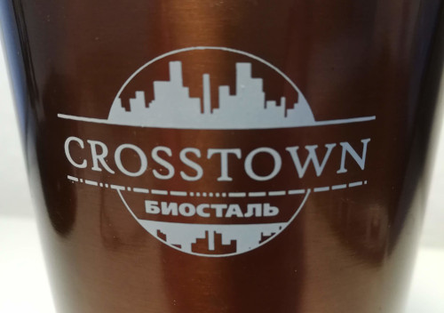

# morse

Decode ambiguous Morse codes using dictionaries.

## Why?

I've been an owner of a beautiful travel mug made by a Russian manufacturer `Biostal` for a couple of years already. But just recently, I found out that the logo on this mug has a set of dashes and dots, which looks like a Morse code `-.-..-.---......----.---.`:

I wanted to check if this code-like looking dashed line is actually a meaningful message encoded using Morse code or just a random sequence of graphical primitives. As you may know, the crucial part of Morse code is pauses being made between letters and words, but apparently, a sequence on the logo was missing this information, which makes decoding indeterminate. For instance, without the knowledge of where letter- and word-breaks should go,  code `-.`  may equally be decoded as `et` or `a`.

## How does it work?

I anticipated that taking brute-force approach of just finding all possible input string permutations resulting in a given code would produce too many nonsense options, so that I'll be flooded with them and won't find an original message (if there was any). I actually wrote a small function calculating the amount of all possible input messages for a given code. It gave me the number of 6994659 for the code from my mug. No way I would try to go through them manually!

So I decided to somehow limit possible input messages to only those, which may have a chance of making sense. The obvious solution was to compose them from actual natural language words, which, in turn, would be collected from some dictionaries. But even this approach was giving me tons of stuff like `tln md i ut matte`. Finally, I realized that for the length of the code I was dealing with, the message with the least amount of word would be the most meaningful. That's why current implementation sorts all found input messages by the number of words in ascending order and returns first 50 items.

## Did I manage to decode my travel mug?

Yes. Turned out code says `crosstown`, which is a name of a product line my mug belongs to. I also tried to decode it using Russian words and Russian Morse code, but the most meaningful message I got was `куем несем тын`, which, well is not tremendously likely was the original source.

## Where did I get dictionaries from?

* English: https://github.com/dwyl/english-words
* Russian: https://github.com/danakt/russian-words
